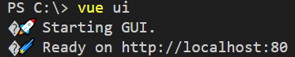
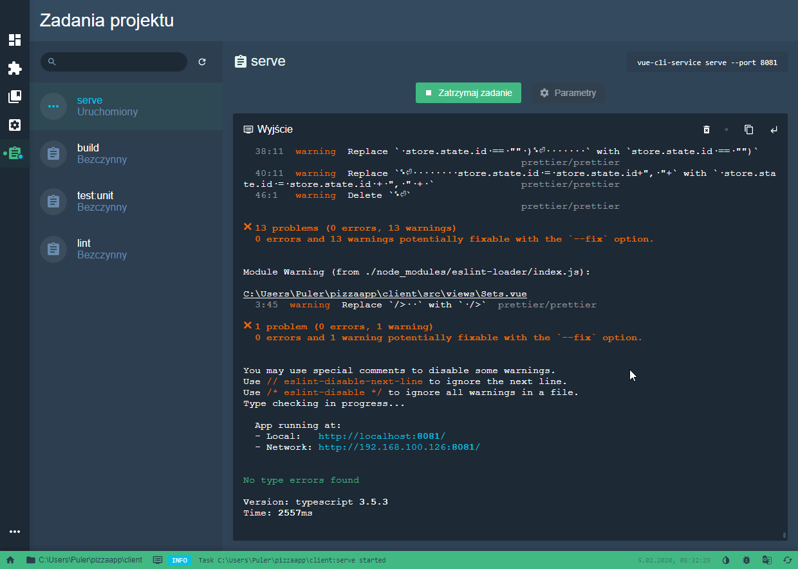
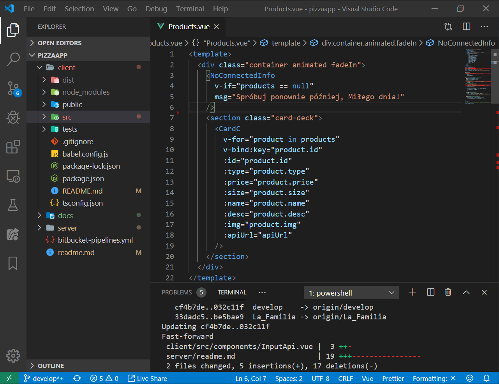

# Vue client app 

## Project setup
```
npm install
```

### Compiles and hot-reloads for development
```
npm run serve
```

### Compiles and minifies for production
```
npm run build
```

### Run your unit tests
```
npm run test:unit
```

### Lints and fixes files
```
npm run lint
```

### Customize configuration
See [Configuration Reference](https://cli.vuejs.org/config/).

# How to setup environment

1. Install **npm** with *Chocolatey* option from https://nodejs.org/en/download/

2. Open terminal as Administrator an paste:
```bash
choco install -y vscode git
```
3. In VS Code *install* Vue extension pack https://marketplace.visualstudio.com/items?itemName=sdras.vue-vscode-extensionpack
       
4. Clone this repo, open client folder
```bash
 git clone https://bitbucket.org/pala_to_pala/pizzaapp.git 
 code -n pizzaapp
```
5. In VS Code use <kbd>Ctrl</kbd> + <kbd> ~</kbd>  shortcut to open terminal and paste to install Package Manager and just install dependencies 
   
```npm
npm install -g @vue/cli
```
```bash
cd client
npm install
```
6. Open user interface management Vue projects. Then go to *client* path folder, next import and run your webpage.
  
```bash
vue ui
```
*Run Java backend server before webpage deploy/serve, to avoid port number conflicts*

##### example command line



##### Vue UI



##### VS Code editor 




