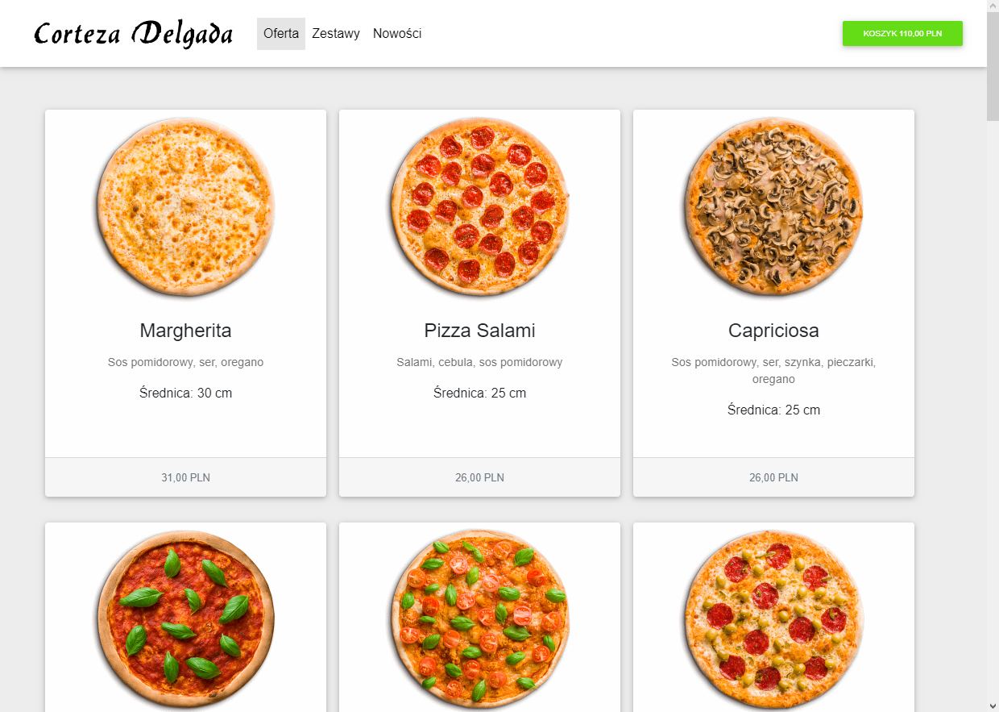
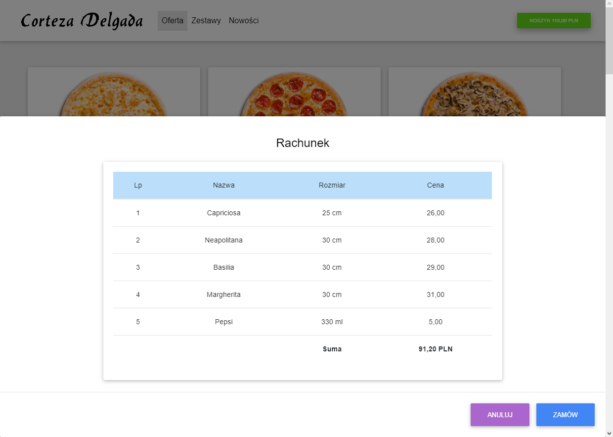

##### Screenshots 


                            





#### Example GitFlow

```bash
git pull                        # sync with remote
git checkout -b feature-MDB_App # create new branch
# Now make some chages in repo files
git status                      # view changes
git add .                       # add current dir
git commit -m "MDB works"       # message what is done
git checkout develop            # back to main brach
git merge feature-MDB_App       # merge from feature brach
```
#### Also see config documentation  in *client, server* directories
